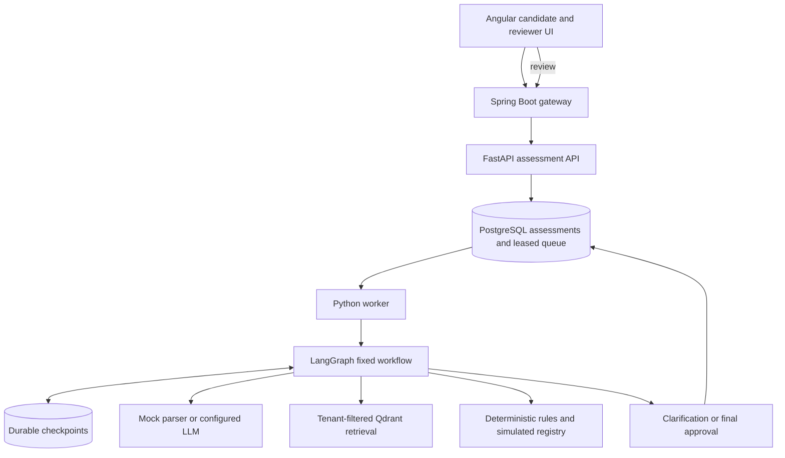

# Architecture and decisions

## Boundaries

Spring Boot authenticates local demo accounts and creates trusted tenant, actor, and role context. FastAPI validates the internal service credential and exposes only explicit endpoints. Matching does not use identity attributes. The worker executes a bounded graph; this is not an autonomous planner.

Extraction can use a real compatible model endpoint. Model output must match the Candidate schema and quote source text exactly. This detects unsupported values, but quotation validation alone cannot prove semantic truth or solve prompt injection. A candidate claim is not employment or credential verification. Final recommendations are derived from rules. Summaries are deterministic, not model-generated, to avoid silently changing mandatory requirements.

Qdrant stores versioned policy records and enforces tenant/job filters. Hash-based vectors are deterministic demo embeddings, not pretrained semantic embeddings. Local mode uses the same scoped corpus and cosine ranking for setup without Qdrant. This version does not implement hybrid BM25/dense retrieval or reranking. Retrieval does not override hard qualification rules.

## State and recovery

Assessment state transitions: QUEUED -> PROCESSING -> AWAITING_CLARIFICATION -> QUEUED, or PROCESSING -> AWAITING_APPROVAL -> COMPLETED. Transient failures return to QUEUED up to a bounded retry count; permanent repeated failures become FAILED. FAILED jobs require operator investigation; there is no public retry endpoint yet.

The database is the durable queue. Jobs have leases and heartbeats. Idempotency keys are scoped to tenant and reject mismatched request bodies. Optimistic versions protect review actions. Resume commands have IDs to avoid applying the same clarification again after a crash. Checkpoints survive process restarts. Interrupted nodes contain no external writes before the interrupt. Stale worker owners cannot commit assessment results.

Run ONE worker in this starter. Application leases do not fence writes inside the LangGraph checkpoint storage. Before enabling multiple worker replicas, add per-assessment advisory locking/fencing across the entire graph invocation and chaos-test lease loss. Do not assume exactly-once LLM billing; a crash after a provider call and before checkpointing may repeat a paid call.

## Data and evidence

Resume text is stored in the application database in this starter. Evidence quotes refer to resume or reviewer input; policies and registry records carry their own sources. Reviews include actor, notes, and corrected values. No real licensing system is contacted. The synthetic registry does not perform candidate identity matching; a production verification adapter must resolve credential ownership as well as number and state.

Audit events cover intake, worker attempts, review actions, and resulting workflow states. They are ordinary database rows, not tamper-evident compliance records. Add retention, encryption, immutable event storage and authorization reviews before processing sensitive real-world records.

## Evaluation

The included exact-value F1 evaluation has five annotated synthetic records. It is a smoke baseline, not evidence of real model accuracy or fairness. Counterfactual name tests cover the mock path; repeat them against every real model configuration with a larger, representative labeled dataset. Measure retrieval recall@k after introducing a larger corpus and semantic encoder.

Successful extraction-call token usage and configurable estimated model cost appear in results. This excludes failed/retried calls, embedding costs, infrastructure, idle capacity and review labor. It is not total cost per completed assessment. Use provider usage exports and infrastructure bills for accounting.

The worker exports Prometheus node timings and attempt counts at internal port 9000. The API process has a separate metrics endpoint containing its own process metrics. Do not interpret one process's endpoint as a combined view of all services. Worker counters describe attempts, not exactly-once completed business transactions, and reset on process restart.
