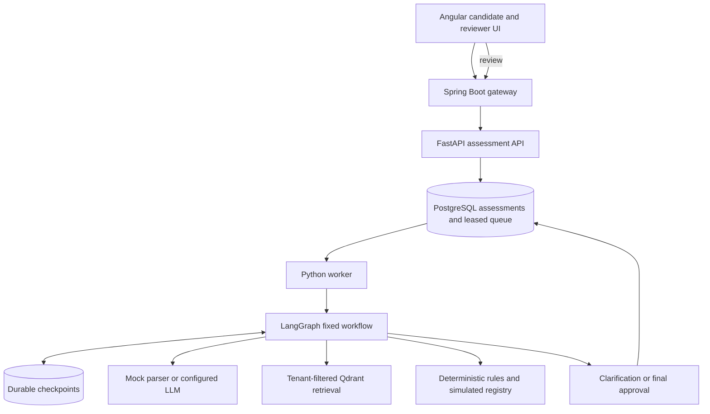

# Architecture and decisions

## Boundaries

Spring Boot authenticates local demo accounts and creates trusted tenant, actor, and role context. FastAPI validates the internal service credential and exposes only explicit endpoints. Matching does not use identity attributes. The worker executes a bounded graph; this is not an autonomous planner.

Extraction can use a real compatible model endpoint. Model output must match the Candidate schema and quote source text exactly. This detects unsupported values, but quotation validation alone cannot prove semantic truth or solve prompt injection. A candidate claim is not employment or credential verification. Final recommendations are derived from rules. Summaries are deterministic, not model-generated, to avoid silently changing mandatory requirements.

Qdrant stores versioned policy records and enforces tenant/job filters. Hash-based vectors are deterministic demo embeddings, not pretrained semantic embeddings. Local mode uses the same scoped corpus and cosine ranking for setup without Qdrant. This version does not implement hybrid BM25/dense retrieval or reranking. Retrieval does not override hard qualification rules.

## State and recovery

Assessment state transitions: QUEUED -> PROCESSING -> AWAITING_CLARIFICATION -> QUEUED, or PROCESSING -> AWAITING_APPROVAL -> COMPLETED. Transient failures return to QUEUED up to a bounded retry count; permanent repeated failures become FAILED. FAILED jobs require operator investigation; there is no public retry endpoint yet.

The database is the durable queue. Jobs have leases and heartbeats. Idempotency keys are scoped to tenant and reject mismatched request bodies. Optimistic versions protect review actions. Resume commands have IDs to avoid applying the same clarification again after a crash. Checkpoints survive process restarts. Interrupted nodes contain no external writes before the interrupt. Stale worker owners cannot commit assessment results.

Run ONE worker in this starter. Application leases do not fence writes inside the LangGraph checkpoint storage. Before enabling multiple worker replicas, add per-assessment advisory locking/fencing across the entire graph invocation and chaos-test lease loss. Do not assume exactly-once LLM billing; a crash after a provider call and before checkpointing may repeat a paid call.

## Data and evidence

Resume text is stored in the application database in this starter. Evidence quotes refer to resume or reviewer input; policies and registry records carry their own sources. Reviews include actor, notes, and corrected values. No real licensing system is contacted. The synthetic registry does not perform candidate identity matching; a production verification adapter must resolve credential ownership as well as number and state.

Audit events cover intake, worker attempts, review actions, and resulting workflow states. They are ordinary database rows, not tamper-evident compliance records. Add retention, encryption, immutable event storage and authorization reviews before processing sensitive real-world records.

## Evaluation

The included exact-value F1 evaluation has five annotated synthetic records. It is a smoke baseline, not evidence of real model accuracy or fairness. Counterfactual name tests cover the mock path; repeat them against every real model configuration with a larger, representative labeled dataset. Measure retrieval recall@k after introducing a larger corpus and semantic encoder.

Successful extraction-call token usage and configurable estimated model cost appear in results. This excludes failed/retried calls, embedding costs, infrastructure, idle capacity and review labor. It is not total cost per completed assessment. Use provider usage exports and infrastructure bills for accounting.

The worker exports Prometheus node timings and attempt counts at internal port 9000. The API process has a separate metrics endpoint containing its own process metrics. Do not interpret one process's endpoint as a combined view of all services. Worker counters describe attempts, not exactly-once completed business transactions, and reset on process restart.

## Tradeoff decisions: cost, latency, throughput, accuracy

Every component in this system involves explicit tradeoffs. These were deliberate design decisions, not defaults.

### Extraction: mock parser vs LLM

| Dimension | Mock regex parser (default) | Compatible LLM endpoint |
|---|---|---|
| **Latency** | < 1ms (in-process) | 1–10s (network + inference) |
| **Cost** | $0 | $0.0005–$0.01 per call (model-dependent) |
| **Throughput** | Unlimited, synchronous | Rate-limited by provider |
| **Accuracy** | 100% on structured input, 0% on free-form text | High on free-form, degrades on adversarial input |
| **Reliability** | Deterministic, no network dependency | Subject to provider outages, rate limits, schema drift |

**Decision:** Default to mock for CI, local dev, and cost-free demos. Make LLM a runtime config flag (`LLM_MODE=compatible`) so production deployments swap without code changes. This is the same pattern used in production ML systems where a fast deterministic path handles high-confidence cases and a model handles the long tail.

### Retrieval: Qdrant vector search vs local fallback

| Dimension | Qdrant (production path) | Local cosine fallback |
|---|---|---|
| **Latency** | 5–20ms (network) | < 1ms (in-process) |
| **Scale** | Millions of documents, HNSW index | Hundreds of documents, linear scan |
| **Filtering** | Server-side tenant + job filter before scoring | Client-side filter after loading all docs |
| **Accuracy** | Approximate nearest neighbor (HNSW) | Exact cosine on small corpus |
| **Ops cost** | Managed service or self-hosted container | Zero — in-memory |

**Decision:** Use Qdrant for Docker/production paths where scale matters. Local fallback for dev, CI, and environments without a vector DB. Tenant and job isolation is enforced by both paths — a scope violation raises an exception before any document reaches the model or response.

**Deliberate deferral:** Hash-based demo embeddings replace a pretrained semantic encoder. Semantic accuracy is intentionally sacrificed for zero-dependency local operation. The retrieval node is architected as a swappable adapter; replacing `vector()` in `retrieval.py` with a real encoder call is the only change needed.

### Embedding: hash-based vs semantic encoder

| Dimension | Hash-based (current) | Semantic encoder (e.g. text-embedding-3-small) |
|---|---|---|
| **Latency** | < 0.1ms | 20–100ms per call |
| **Cost** | $0 | ~$0.00002 per 1K tokens |
| **Accuracy** | Keyword overlap only | Semantic similarity, handles paraphrasing |
| **Determinism** | Fully deterministic | Deterministic given same model version |

**Decision:** Hash embeddings are sufficient for the small synthetic policy corpus and allow the full RAG pipeline to run without any API keys or network calls. Noted as the primary accuracy extension point in `README.md`.

### Workflow persistence: SQLite vs PostgreSQL

| Dimension | SQLite (local dev default) | PostgreSQL (Docker/production) |
|---|---|---|
| **Latency** | Sub-millisecond | 1–5ms per query |
| **Concurrency** | Single-writer | Multi-writer with row-level locking |
| **Ops burden** | Zero — file on disk | Container or managed service required |
| **Durability** | File-based WAL, suitable for single node | ACID, WAL, replication-ready |

**Decision:** SQLite for local development removes the Postgres dependency from the inner loop. LangGraph's checkpoint and store layers abstract the backend — switching is a single env var change (`DATABASE_URL`, `CHECKPOINT_URL`). This is the same approach used by teams that want fast local iteration without compromising production fidelity.

### Worker concurrency: single worker vs multiple replicas

**Decision:** Single worker in this starter. The LangGraph checkpoint storage (SQLite or Postgres) does not include cross-process fencing for graph invocations. Running multiple workers without advisory locking risks two workers both claiming the same assessment, both checkpointing divergent state, with the last writer winning silently. Documented as a known scale constraint. The fix (per-assessment distributed lock wrapping the entire `graph.invoke` call) is a one-function change but requires chaos testing before enabling.

**Throughput measured:** 124 assessments/minute at p50=528ms, p95=551ms end-to-end (submission through ready-for-review, including queue polling delay) on a single worker with mock extraction. LLM extraction latency is additive — a 2s inference call raises p50 to ~2.5s.

### Guardrails: grounded evidence as a hard constraint

**Decision:** Every extracted field requires a verbatim quote from the source text. The `grounded()` function checks:
1. The quote exists in the source (resume or reviewer notes)
2. For numeric fields: the number in the quote matches the extracted value exactly
3. For string fields: the value appears literally in the quote (case-insensitive)

This is a mathematical constraint, not a prompt instruction. A model that hallucinates a value without a matching quote fails validation before the value reaches the rules engine. This trades recall (some valid resumes may be sent to clarification) for precision (no hallucinated values can generate a false positive eligibility result). In a healthcare credential context, false positives are more dangerous than false negatives.

### Summary generation: deterministic vs model-generated

**Decision:** Summaries are built from rule reasons concatenated deterministically, not generated by the model. This means:
- Summaries cannot silently change mandatory requirements
- Summary text is auditable and reproducible
- No LLM cost for summaries
- Trade-off: less fluent prose than a model-generated narrative

The recommendation (`REQUIREMENTS_MET` / `REQUIREMENTS_NOT_MET` / `VERIFICATION_PENDING`) is derived from rule statuses, never from model self-assessment of confidence.
